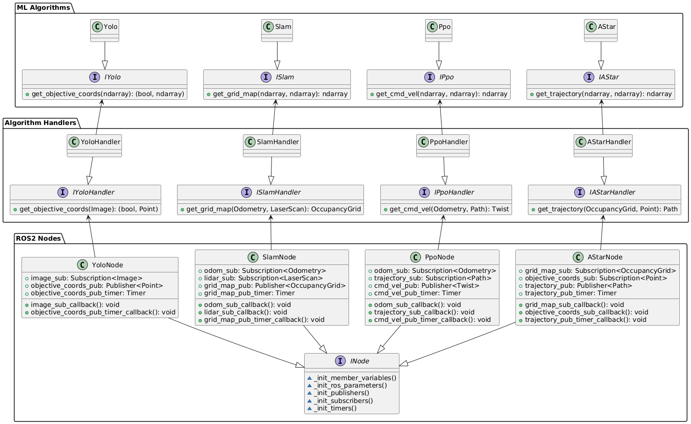

# Project Structure

The structure of our project is shown in the diagram below:

The larger boxes represent packages or "layers" of our project. The code is divided into these layers to allow for the separation of concerns. Each layer does not need to know about the existance of the layers beneath it, and only needs to know about the interfaces of the layer above it. This makes the code more modular and easier to change and maintain.

Each of the smaller boxes represents a class in our project. The text in each of these boxes represents the class's functions or data members. Of particular importance are the public functions (preceded by a green dot) defined in the interface classes (which have a purple symbol and start with an _I_). These are the functions that connect different layers of code together, and they **must be implemented** in their **non-interface counterparts** for the code to work.

This also specifies the _"is a"_ and _"has a"_ relationship between each of the classes. The closed white arrows show an _"is a"_ relationship, which means that a class inherits whichever class it points to. The open black arrows show a _"has a"_ relationship, which means that a class contains an instance of whichever class it points to.

It is important that the arrows between each layer point in only one direction (regardless of which type of arrow they are), because it removes cyclic dependencies and allows you to work on the upper layers without having to worry about the lower layers.

Each of these layers--_ML Algorithms_, _Algorithm Handlers_, and _ROS2 Nodes_--are detailed below.

### ML Algorithms

This is where the ML algorithms are implemented. The only classes that you need to edit are the **non-interface classes** (the classes whose names do not start with an _I_). These classes implement the outward-facing functions specified in the interface classes, but can have numerous internal "helper functions" (as many as you'd like). As long as you implement the outward-facing functions, and as long as the interface classes do not change, everything in the lower layers should work as expected.

**NOTE:** The interfaces in this layer are subject to change, depending on which inputs and outputs are most convenient for each ML algorithm. In other words, **implement the algorithms without regard for the input or output types**, and then share with the group which inputs/outputs are most convenient. **Do NOT change the interface classes without communicating with the group, or else the lower layers may stop working.**

### Algorithm Handlers

This is where "wrapper classes" for the ML algorithms are defined. Basically, these classes convert ROS messages into data that the ML algorithms can use and vice-versa. Their basic functionality is as follows:

1. Convert ROS messages into data for ML algorithm
2. Run ML algorithm
3. Convert results from ML algorithm into ROS messages

This will allow all data conversion, preprocessing, etc. to take place here without making the other layers worry about it.

The only classes that you need to implement are the **non-interface classes** (classes whose names do not start with an _I_). These classes implement the outward-facing functions specified in the interface classes, but can have numerous internal "helper functions" (as many as you'd like). As long as you implement the outward-facing functions, and as long as the interface classes do not change, everything in the lower layers will work as expected.

### ROS2 Nodes

These classes implement ROS2 nodes. They pass information to each other through their publishers and receive information through their subscribers. Once information is received, they call upon the algorithm handlers to process incoming data and generate outgoing data.

These node classes are already set up to work with the _Algorithm Handlers_ layer's interfaces, so they do not need to be changed.
